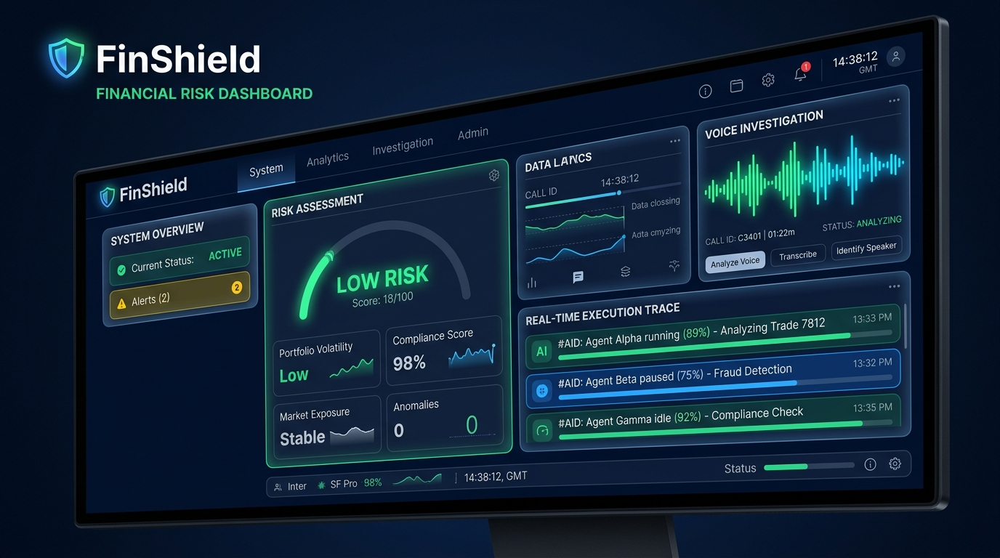
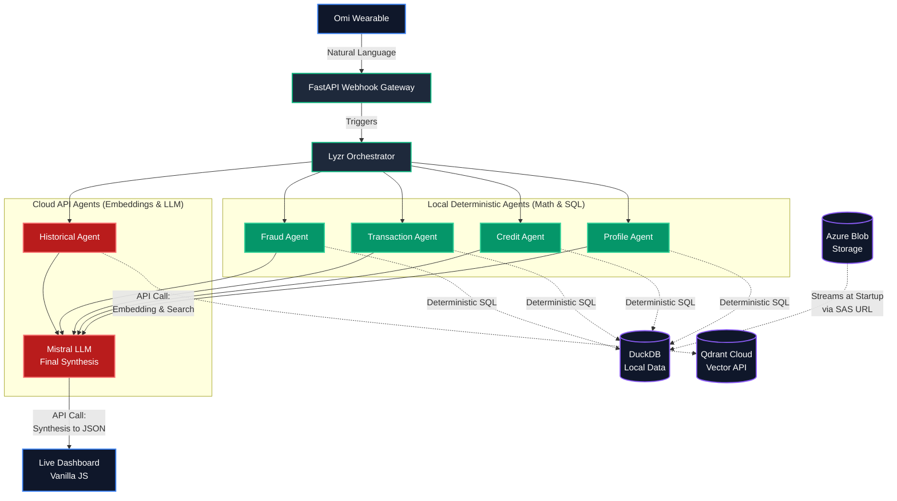
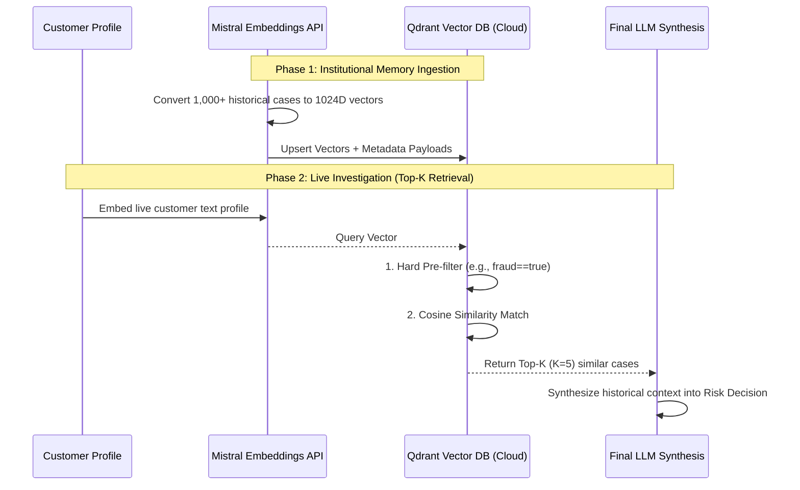
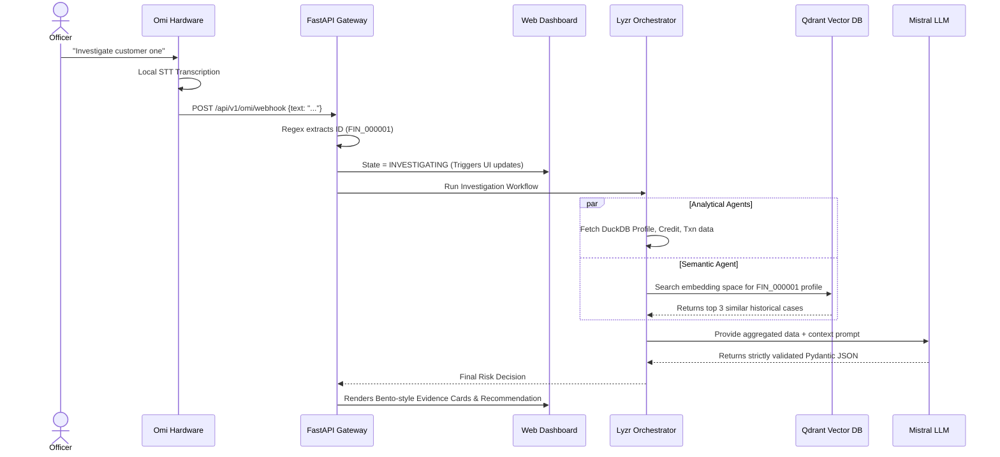

<div align="center">
  
  <h1>🛡️ FINSHIELD</h1>
  <p><strong>Autonomous Banking Risk & Fraud Investigator</strong></p>
  <p><em>Built for "The Dawn of the Autonomous AI Builder" (Organized by Lyzr × Qdrant × Omi)</em></p>
</div>

---

## 🛑 The Problem Statement (PS)

In modern banking, risk officers and fraud analysts are drowning in fragmented data. When investigating a customer for a loan approval or suspicious activity, an officer must manually cross-reference:
1. Static credit scores and demographic profiles.
2. Hundreds of recent transaction logs looking for cash-out velocity anomalies.
3. Fraud flags across different banking systems.
4. Past institutional memory (e.g., "Have we seen a similar profile default before?").

**The Bottleneck:** This process takes hours per customer. Traditional dashboards require high-friction clicking, SQL querying, and manual synthesis. Meanwhile, simple LLM wrappers fail because they hallucinate calculations and cannot reliably orchestrate multiple data sources.

---

## 💡 The Solution

**FinShield** is a voice-first, persistent, multi-agent copilot. 

Instead of clicking through dashboards, a risk officer simply taps their Omi wearable and says: 
> *"Investigate customer two zero four four two."*

Instantly, FinShield springs to life:
1. **Omi** captures the ambient command and streams it to the backend.
2. **Lyzr** orchestrates a swarm of specialized, deterministic AI agents (Credit, Transaction, Fraud).
3. **Qdrant** injects semantic historical memory, instantly retrieving similar past cases.
4. The system synthesizes a final, explainable **Risk Assessment** directly onto a live-updating Web Dashboard, complete with color-coded recommendations and evidence cards.

---

## 🎯 Why This Approach? (Beyond Simple RAG)

Isolated prompts and simple RAG (Retrieval-Augmented Generation) have hit a ceiling. Financial compliance demands **deterministic execution** and **explainability**. 

FinShield solves this by decoupling *reasoning* from *data retrieval*:
- **Specialized DAG Execution**: Instead of asking one LLM to do everything, FinShield uses a Lyzr Directed Acyclic Graph (DAG) to launch specialized sub-agents. The Analytical Agents (e.g., Profile, Credit, Transaction, Fraud) ONLY run deterministic SQL against DuckDB; they don't invent math.
- **Stateful & Observable**: Every agent's execution latency, status, and output is fully observable in real-time on the UI.
- **Semantic Institutional Memory**: By embedding past case files into Qdrant, the system develops "intuition", warning officers if a seemingly safe customer matches the behavioral profile of a historical default.

---

## 🧠 Core Technology Stack

| Technology | Role in FinShield |
|:---|:---|
| 🎙️ **Omi** | **Ambient Voice Capture.** Provides frictionless, hands-free initiation of complex workflows via webhook streaming. |
| 🤖 **Lyzr** | **Agentic Orchestration.** Manages the DAG pipeline, ensuring agents execute in the correct order and share state. |
| 🗄️ **Qdrant** | **Semantic Vector Memory.** Stores high-dimensional embeddings of historical fraud cases for rapid similarity matching. |
| 🧠 **Mistral / GPT-4** | **Cognitive Synthesis.** Analyzes the raw data outputs from all agents to formulate a human-readable recommendation. |
| 🦆 **DuckDB** | **Analytical Data Layer.** Executes lightning-fast, parameterized SQL queries on 50,000+ customer records. |
| ☁️ **Azure Cloud** | **App Service & Blob Storage.** Hosts the production Docker container and streams the DuckDB database securely into memory at runtime to bypass SMB locks. |
| ⚡ **FastAPI & Vanilla JS** | **Backend & Live UI.** Provides API hardening, asynchronous state polling, and a completely framework-less, lightning-fast frontend. |

---

## 🏛️ Architecture Deep Dive

FinShield operates in a continuous **Voice-to-Memory-to-Agent** loop.

### 1. Macro Architecture: The Agentic Swarm
This diagram illustrates the topological structure of the FinShield orchestrator.



### 🧠 Agent Execution Strategy: Math vs. APIs
A core philosophy of FinShield is separating **deterministic calculation** from **probabilistic synthesis** to ensure enterprise-grade reliability and avoid LLM hallucination on financial numbers.

- 🟢 **Local Deterministic Agents (No APIs):** The Profile, Credit, Transaction, and Fraud agents **do not** make LLM API calls. They run locally within the Python environment, executing highly optimized, deterministic SQL queries against DuckDB to calculate exact math (e.g., transaction volumes, fraud ratios). This guarantees 100% mathematical accuracy and near-zero latency.
- 🔴 **Cloud API Agents:** The Historical Agent makes an external API call to embed the current case (via Mistral Embeddings) and searches the Qdrant Cloud cluster. Finally, the Mistral LLM agent makes a single API call at the very end of the pipeline to synthesize the raw math provided by the deterministic agents into a human-readable recommendation.

### 🌐 Semantic Memory Pipeline (Mistral + Qdrant)
Traditional banking systems only check exact keyword matches or hardcoded rules. FinShield uses **Vector Embeddings** to give the AI "intuition" about customer behavior. 

#### Retrieval Methodology: Top-K with Metadata Pre-Filtering
FinShield uses a **hybrid vector search strategy**:
1. **Metadata Pre-Filtering**: Before any math happens, Qdrant applies hard filters (e.g., `has_prior_fraud_flags == True`) to instantly narrow the search space to relevant case types.
2. **Top-K Dense Retrieval (K=5)**: Using Cosine Similarity on 1024-dimensional Mistral embeddings, the system retrieves the top 5 (Top-K) most mathematically similar historical cases to the current customer's profile.

#### Pipeline Flow


### 2. Execution Loop: Voice-to-Decision Sequence
This sequence diagram shows the real-time temporal flow of a single voice command.



---

## 🚀 Quickstart & Demo Setup

### 1. Prerequisites
- Python 3.12+
- `ngrok` (for Omi webhook tunneling)

### 2. Environment Setup
```bash
python -m venv .venv

# Activate venv on Windows:
.\.venv\Scripts\activate

# Activate venv on Mac/Linux:
source .venv/bin/activate

pip install -r requirements.txt
```

### 3. Configuration
Copy the environment template:
```bash
cp .env.example .env
```
Fill in your API keys (`LYZR_API_KEY`, `MISTRAL_API_KEY`, and `QDRANT_API_KEY`).

### 4. Data Initialization (Required on first run)
Because FinShield operates on 50,000+ real customer records, the raw datasets are excluded from Git to save space. You must generate the local `finshield.duckdb` database, the optimized `.parquet` files, and seed the Qdrant vector database.

Run the data pipelines in this exact order:
```bash
# 1. Transform raw CSVs into highly-compressed Parquet files & seed DuckDB
python scripts/profile_data.py

# 2. Extract historical cases and inject them into Qdrant semantic memory
python scripts/qdrant_ingest.py
```

### 5. Utility & Debug Scripts
FinShield includes several utility scripts in the `scripts/` folder for testing and validation:
- **`run_api.py`**: The main entry point to start the FastAPI server programmatically (used by `start.bat`).
- **`validation.py`**: Verifies that your `.env` variables and Pydantic models are correctly configured.
- **`qdrant_check.py`**: Pings your Qdrant instance to verify connection and prints collection stats.
- **`qdrant_search.py`**: Allows you to run a manual semantic search query directly against Qdrant without using the UI.
- **`phase[X]_demo.py`**: Isolated scripts used to test specific subsets of the agentic workflow during development.

### 6. Start the Application
Run the provided startup script. This will launch both the FastAPI server and the ngrok tunnel simultaneously:
```cmd
start.bat
```
*(Mac/Linux users: run `python scripts/run_api.py` and manually start `ngrok http 8000`)*

### 5. Omi Webhook Binding
1. Copy the `https://<random-string>.ngrok-free.dev` URL generated in your terminal.
2. Open your Omi App -> Developer Settings.
3. Set your Webhook URL to: `https://<your-ngrok-url>/api/v1/omi/webhook`

---

## 🎙️ Testing the Live Demo

1. Open the **FinShield dashboard** at `http://localhost:8000`.
2. Ensure the "System: Healthy" and "Omi: Ready" indicators are glowing green.
3. Speak clearly into your Omi device:
   > **"Investigate customer one"** 
   > *(System parses -> FIN_000001)*
   
   > **"Check risk profile for customer two zero four four two"** 
   > *(System parses -> FIN_020442)*
4. **Observe:** The UI will immediately catch the transcript, the Lyzr Trace will light up as agents execute in real-time, and the final LLM decision will render interactively.

---

## 🧪 Testing & Validation

FinShield includes a robust Pytest suite verifying memory insertion, orchestration logic, voice transcription fallbacks, and API boundary validation.

```bash
# Run all tests (29/29 Passing)
pytest tests/ -v
```

---

## 🚢 Production Deployment

### Docker Deployment
A production-ready `Dockerfile` is included. It uses `python:3.12-slim`, exposes port `8000`, and integrates `/health/dependencies` checks for Kubernetes/load-balancer liveness probes.

```bash
docker build -t finshield .
docker run -p 8000:8000 --env-file .env finshield
```

### Azure App Service Deployment
FinShield is architected to run seamlessly on **Azure App Service (Linux Containers)**. 

To prevent SMB file-locking issues that occur when mounting SQLite/DuckDB databases on Azure's persistent `/home` volumes, the architecture utilizes **Azure Blob Storage**.

1. Upload your generated `finshield.duckdb` file to a secure Azure Blob Container.
2. Generate a Read-Only SAS URL for the blob.
3. In your Azure App Service Configuration, set the `DUCKDB_DOWNLOAD_URL` environment variable to your SAS URL.
4. Set your Omi Webhook to point to your live Azure domain (e.g., `https://<your-app-name>.azurewebsites.net/api/v1/omi/webhook`).

At container startup, the application securely streams the DuckDB file into the high-speed `/tmp` ephemeral storage layer, ensuring zero database locking errors and lightning-fast read performance.
