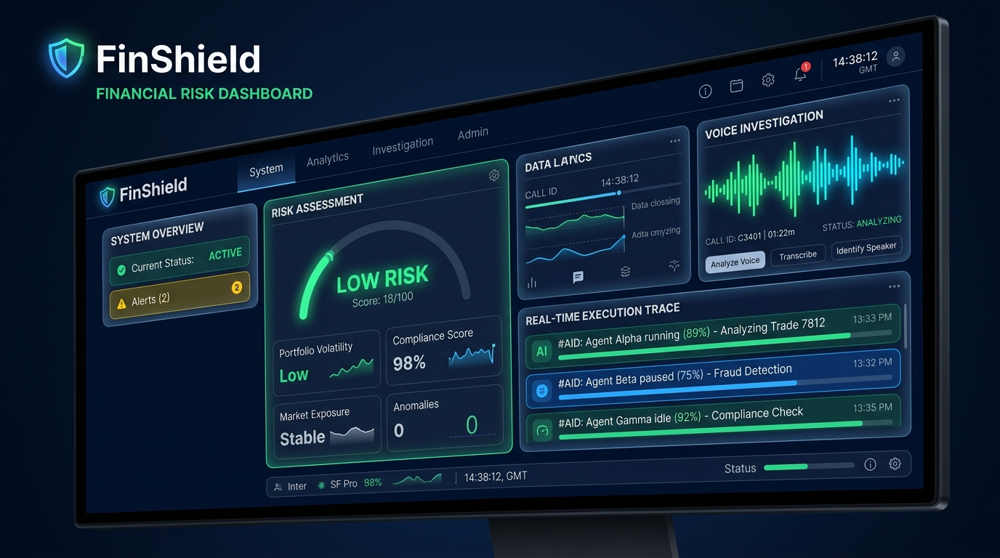
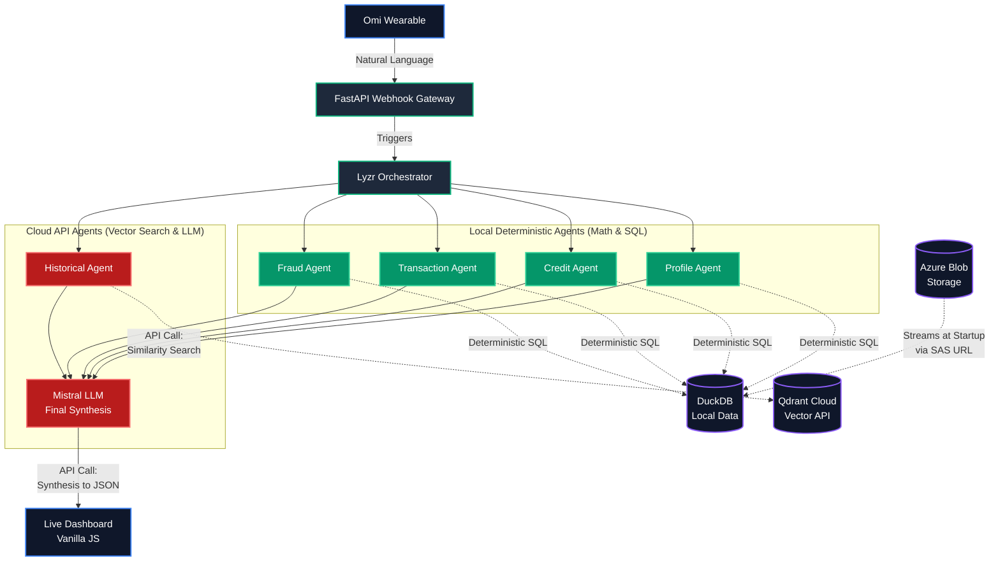
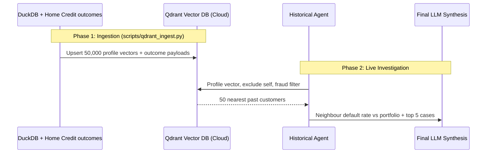
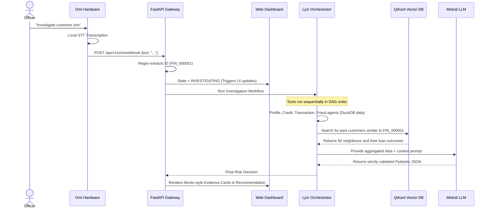

<div align="center">
  
  <h1>🛡️ FINSHIELD</h1>
  <p><strong>Autonomous Banking Risk & Fraud Investigator</strong></p>
  <p><em>Built for "The Dawn of the Autonomous AI Builder" (Organized by Lyzr × Qdrant × Omi)</em></p>
</div>

---

## 🛑 The Problem Statement (PS)

In modern banking, risk officers and fraud analysts are drowning in fragmented data. When investigating a customer for a loan approval or suspicious activity, an officer must manually cross-reference:
1. Static credit scores and demographic profiles.
2. Hundreds of recent transaction logs looking for cash-out velocity anomalies.
3. Fraud flags across different banking systems.
4. Past institutional memory (e.g., "Have we seen a similar profile default before?").

**The Bottleneck:** This process takes hours per customer. Traditional dashboards require high-friction clicking, SQL querying, and manual synthesis. Meanwhile, simple LLM wrappers fail because they hallucinate calculations and cannot reliably orchestrate multiple data sources.

---

## 💡 The Solution

**FinShield** is a voice-first, persistent, multi-agent copilot. 

Instead of clicking through dashboards, a risk officer simply taps their Omi wearable and says: 
> *"Investigate customer two zero four four two."*

Instantly, FinShield springs to life:
1. **Omi** captures the ambient command and streams it to the backend.
2. **Lyzr** orchestrates a swarm of specialized, deterministic AI agents (Credit, Transaction, Fraud).
3. **Qdrant** recalls the most similar past customers and how often they actually defaulted.
4. The system synthesizes a final, explainable **Risk Assessment** directly onto a live-updating Web Dashboard, complete with color-coded recommendations and evidence cards.

---

## 🎯 Why This Approach? (Beyond Simple RAG)

Isolated prompts and simple RAG (Retrieval-Augmented Generation) have hit a ceiling. Financial compliance demands **deterministic execution** and **explainability**. 

FinShield solves this by decoupling *reasoning* from *data retrieval*:
- **Specialized DAG Execution**: Instead of asking one LLM to do everything, a Lyzr orchestrator agent (GPT-4o) calls six specialized tools in a fixed order. If the orchestrator skips or aborts a step, the backend finishes the remaining steps itself, so every investigation completes. The Analytical Agents (e.g., Profile, Credit, Transaction, Fraud) ONLY run deterministic SQL against DuckDB; they don't invent math.
- **Stateful & Observable**: Every agent's execution latency, status, and output is fully observable in real-time on the UI.
- **Institutional Memory with Real Outcomes**: Past customers are stored in Qdrant with their actual loan outcomes, so the system can warn officers when a seemingly safe customer resembles a population that defaulted at an above-average rate.

---

## 🧠 Core Technology Stack

| Technology | Role in FinShield |
|:---|:---|
| 🎙️ **Omi** | **Ambient Voice Capture.** Provides frictionless, hands-free initiation of complex workflows via webhook streaming. |
| 🤖 **Lyzr** | **Agentic Orchestration.** Manages the DAG pipeline, ensuring agents execute in the correct order and share state. |
| 🗄️ **Qdrant** | **Case Memory.** Stores 50,000 past customers as profile vectors with real loan outcomes for similarity search. |
| 🧠 **Mistral** | **Cognitive Synthesis.** `mistral-small-latest` turns the agents' raw outputs into a human-readable recommendation. Hard rules (e.g. confirmed fraud ⇒ decline) are enforced in code, and if the LLM fails the decision falls back to the worst deterministic agent verdict with a manual-review flag. |
| 🦆 **DuckDB** | **Analytical Data Layer.** Executes lightning-fast, parameterized SQL queries on 50,000+ customer records. |
| ☁️ **Azure Cloud** | **App Service & Blob Storage.** Hosts the production Docker container and streams the DuckDB database securely into memory at runtime to bypass SMB locks. |
| ⚡ **FastAPI & Vanilla JS** | **Backend & Live UI.** Provides API hardening, asynchronous state polling, and a completely framework-less, lightning-fast frontend. |

---

## 🏛️ Architecture Deep Dive

FinShield operates in a continuous **Voice-to-Memory-to-Agent** loop.

### 1. Macro Architecture: The Agentic Swarm
This diagram illustrates the topological structure of the FinShield orchestrator.


```mermaid
flowchart TD
    %% Define Styles
    classDef hardware fill:#0f172a,stroke:#3b82f6,stroke-width:2px,color:#fff
    classDef backend fill:#1e293b,stroke:#10b981,stroke-width:2px,color:#fff
    classDef agent_math fill:#059669,stroke:#34d399,stroke-width:2px,color:#fff
    classDef agent_api fill:#b91c1c,stroke:#f87171,stroke-width:2px,color:#fff
    classDef data fill:#0f172a,stroke:#8b5cf6,stroke-width:2px,color:#fff
    
    %% Components
    O[Omi Wearable]:::hardware
    W[FastAPI Webhook Gateway]:::backend
    
    %% Agents
    O_Lyzr[Lyzr Orchestrator]:::backend
    
    subgraph local_agents ["Local Deterministic Agents (Math & SQL)"]
        A_Prof[Profile Agent]:::agent_math
        A_Cred[Credit Agent]:::agent_math
        A_Txn[Transaction Agent]:::agent_math
        A_Fraud[Fraud Agent]:::agent_math
    end
    
    subgraph cloud_agents ["Cloud API Agents (Vector Search & LLM)"]
        A_Hist[Historical Agent]:::agent_api
        M[Mistral LLM\nFinal Synthesis]:::agent_api
    end
    
    %% Data Stores
    Blob[(Azure Blob\nStorage)]:::data
    DB[(DuckDB\nLocal Data)]:::data
    Q[(Qdrant Cloud\nVector API)]:::data
    
    Blob -. "Streams at Startup\nvia SAS URL" .-> DB
    
    %% Endpoints
    UI[Live Dashboard\nVanilla JS]:::hardware

    %% Flow
    O -- "Natural Language" --> W
    W -- "Triggers" --> O_Lyzr
    
    O_Lyzr --> A_Prof
    O_Lyzr --> A_Cred
    O_Lyzr --> A_Txn
    O_Lyzr --> A_Fraud
    O_Lyzr --> A_Hist
    
    A_Prof -. "Deterministic SQL" .-> DB
    A_Cred -. "Deterministic SQL" .-> DB
    A_Txn -. "Deterministic SQL" .-> DB
    A_Fraud -. "Deterministic SQL" .-> DB
    
    A_Hist -. "API Call:\nSimilarity Search" .-> Q
    
    A_Prof & A_Cred & A_Txn & A_Fraud & A_Hist --> M
    M -- "API Call:\nSynthesis to JSON" --> UI
```

### 🧠 Agent Execution Strategy: Math vs. APIs
A core philosophy of FinShield is separating **deterministic calculation** from **probabilistic synthesis** to ensure enterprise-grade reliability and avoid LLM hallucination on financial numbers.

- 🟢 **Local Deterministic Agents (No APIs):** The Profile, Credit, Transaction, and Fraud agents **do not** make LLM API calls. They run locally within the Python environment, executing highly optimized, deterministic SQL queries against DuckDB to calculate exact math (e.g., transaction volumes, fraud ratios). This guarantees 100% mathematical accuracy and near-zero latency.
- 🔴 **Cloud API Agents:** The Historical Agent searches the Qdrant Cloud cluster for the nearest past customers. Finally, the Mistral LLM agent makes a single API call at the very end of the pipeline to synthesize the raw math provided by the deterministic agents into a human-readable recommendation.

### 🌐 Institutional Memory Pipeline (Qdrant)
Every past customer is stored in Qdrant together with their **real loan outcome** (the Home Credit `TARGET` label: defaulted or repaid). An investigation asks a concrete question: *"of the 50 past customers most like this one, how many defaulted, compared with the 8% portfolio average?"*

#### Retrieval Methodology
1. **Profile vectors**: each customer is an 11-dimensional vector of z-scored features (age, employment, log income/credit/annuity/debt/overdue, late payments, repayment ratio, bureau score). Distance is Euclidean.
2. **Filtering**: the customer under investigation is always excluded (`must_not customer_id`). Customers with fraud flags are compared only with other flagged customers.
3. **Top-K**: the 50 nearest neighbours give the default rate, and the closest 5 are shown as evidence cards.

*Why not text embeddings?* An earlier version embedded case text with Mistral. Because the texts are mostly numbers, every customer came out ~0.90 similar to every other, and all customers got the same top 3 results. A backtest of the current design on 400 customers gives an AUC of **0.667**: the neighbour default rate ranks a real defaulter above a repayer two-thirds of the time. It has 0 self-matches, and 397 different top matches across 400 customers.

#### Pipeline Flow

```mermaid
sequenceDiagram
    participant DB as DuckDB + Home Credit outcomes
    participant Qdrant as Qdrant Vector DB (Cloud)
    participant Agent as Historical Agent
    participant LLM as Final LLM Synthesis

    Note over DB,Qdrant: Phase 1: Ingestion (scripts/qdrant_ingest.py)
    DB->>Qdrant: Upsert 50,000 profile vectors + outcome payloads

    Note over Agent,LLM: Phase 2: Live Investigation
    Agent->>Qdrant: Profile vector, exclude self, fraud filter
    Qdrant-->>Agent: 50 nearest past customers
    Agent->>LLM: Neighbour default rate vs portfolio + top 5 cases
```

### 2. Execution Loop: Voice-to-Decision Sequence
This sequence diagram shows the real-time temporal flow of a single voice command.


```mermaid
sequenceDiagram
    actor Officer
    participant Omi as Omi Hardware
    participant API as FastAPI Gateway
    participant UI as Web Dashboard
    participant Lyzr as Lyzr Orchestrator
    participant Qdrant as Qdrant Vector DB
    participant LLM as Mistral LLM

    Officer->>Omi: "Investigate customer one"
    Omi->>Omi: Local STT Transcription
    Omi->>API: POST /api/v1/omi/webhook {text: "..."}
    
    API->>API: Regex extracts ID (FIN_000001)
    API->>UI: State = INVESTIGATING (Triggers UI updates)
    
    API->>Lyzr: Run Investigation Workflow
    
    Note over Lyzr: Tools run sequentially in DAG order
    Lyzr->>Lyzr: Profile, Credit, Transaction, Fraud agents (DuckDB data)
    Lyzr->>Qdrant: Search for past customers similar to FIN_000001
    Qdrant-->>Lyzr: Returns 50 neighbours and their loan outcomes
    
    Lyzr->>LLM: Provide aggregated data + context prompt
    LLM-->>Lyzr: Returns strictly validated Pydantic JSON
    
    Lyzr-->>API: Final Risk Decision
    API->>UI: Renders Bento-style Evidence Cards & Recommendation
```

---

## 🚀 Quickstart & Demo Setup

### 1. Prerequisites
- Python 3.12+
- `ngrok` (for Omi webhook tunneling)

### 2. Environment Setup
```bash
python -m venv .venv

# Activate venv on Windows:
.\.venv\Scripts\activate

# Activate venv on Mac/Linux:
source .venv/bin/activate

pip install -r requirements.txt
```

### 3. Configuration
Copy the environment template:
```bash
cp .env.example .env
```
Fill in your API keys (`LYZR_API_KEY`, `MISTRAL_API_KEY`, and `QDRANT_API_KEY`).

### 4. Data Initialization (Required on first run)
FinShield runs on a prebuilt DuckDB database (`finshield/database/finshield.duckdb`, ~800 MB, 50,000 customers) derived from the Home Credit and PaySim datasets. The database and data files are excluded from Git, and **the repo does not contain the script that builds the database from the raw CSVs**, so obtain a copy of `finshield.duckdb` and place it at the path above.

Then seed Qdrant and sanity-check the data:
```bash
# 1. Load all past customers + real outcomes into Qdrant (~35s, no API calls)
#    Reads finshield/data/raw/home_credit/application_train.csv for the TARGET labels
PYTHONPATH=. python scripts/qdrant_ingest.py

# 2. (Optional) Print row counts, schemas and samples of every DuckDB table
PYTHONPATH=. python scripts/profile_data.py
```

### 5. Utility & Debug Scripts
FinShield includes several utility scripts in the `scripts/` folder for testing and validation:
- **`run_api.py`**: The main entry point to start the FastAPI server programmatically (used by `start.bat`). Auto-reload is on unless `APP_ENV=production`.
- **`profile_data.py`**: Prints row counts, schemas and sample rows for every DuckDB table.
- **`validation.py`**: Builds and prints the investigation context for `FIN_000001`, verifying the DuckDB data and Pydantic models.
- **`qdrant_check.py`**: Verifies the Qdrant connection and prints the collection's point count, vector config and indexes.
- **`qdrant_search.py --customer-id FIN_000001`**: Shows a customer's nearest past customers and their outcomes without using the UI.
- **`phase[X]_demo.py`**: Isolated scripts used to test specific subsets of the agentic workflow during development.

### 6. Start the Application
Run the provided startup script. This will launch both the FastAPI server and the ngrok tunnel simultaneously:
```cmd
start.bat
```
*(Mac/Linux users: run `python scripts/run_api.py` and manually start `ngrok http 8000`)*

### 5. Omi Webhook Binding
1. Copy the `https://<random-string>.ngrok-free.dev` URL generated in your terminal.
2. Open your Omi App -> Developer Settings.
3. Set your Webhook URL to: `https://<your-ngrok-url>/api/v1/omi/webhook`

---

## 🎙️ Testing the Live Demo

1. Open the **FinShield dashboard** at `http://localhost:8000`.
2. Ensure the "System: Healthy" indicator is green. "Degraded" means `/health/dependencies` found DuckDB or Qdrant unreachable, or an API key missing.
3. Speak clearly into your Omi device:
   > **"Investigate customer one"** 
   > *(System parses -> FIN_000001)*
   
   > **"Check risk profile for customer two zero four four two"** 
   > *(System parses -> FIN_020442)*
4. **Observe:** The UI picks up the transcript, shows the trace as running, and renders the result of the voice-triggered investigation once it completes.

---

## 🧪 Testing & Validation

FinShield includes a robust Pytest suite verifying memory insertion, orchestration logic, voice transcription fallbacks, and API boundary validation.

```bash
pytest tests/ -v
```
`test_data_layer.py` reads the real `finshield.duckdb`; all other tests mock external services.

---

## 🚢 Production Deployment

### Docker Deployment
A production-ready `Dockerfile` is included. It uses `python:3.12-slim`, exposes port `8000`, and integrates `/health/dependencies` checks for Kubernetes/load-balancer liveness probes.

```bash
docker build -t finshield .
docker run -p 8000:8000 --env-file .env finshield
```

### Azure App Service Deployment
FinShield is architected to run seamlessly on **Azure App Service (Linux Containers)**. 

To prevent SMB file-locking issues that occur when mounting SQLite/DuckDB databases on Azure's persistent `/home` volumes, the architecture utilizes **Azure Blob Storage**.

1. Upload your generated `finshield.duckdb` file to a secure Azure Blob Container.
2. Generate a Read-Only SAS URL for the blob.
3. In your Azure App Service Configuration, set the `DUCKDB_DOWNLOAD_URL` environment variable to your SAS URL.
4. Set your Omi Webhook to point to your live Azure domain (e.g., `https://<your-app-name>.azurewebsites.net/api/v1/omi/webhook`).

At container startup, the application securely streams the DuckDB file into the high-speed `/tmp` ephemeral storage layer, ensuring zero database locking errors and lightning-fast read performance.
